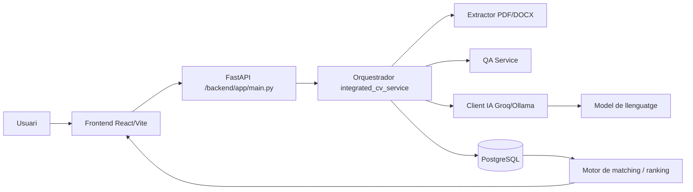
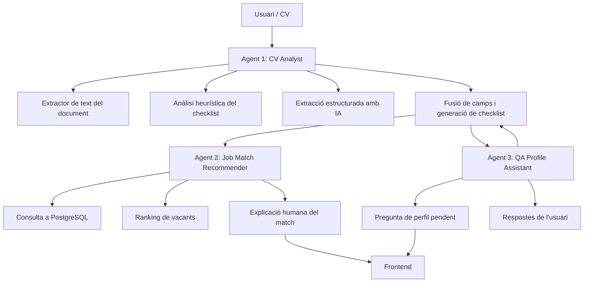
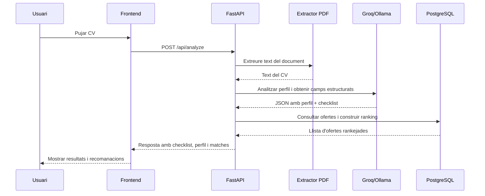

# Arquitectura de TalentMatch AI

Aquest document defineix el disseny arquitectònic del projecte Mavericks com a sistema modular d'IA per a l'anàlisi de CVs, la construcció de perfils i el matching amb ofertes.

## 1. Objectiu del sistema

TalentMatch AI ha de permetre a un candidat:

- pujar un CV en format PDF o DOCX;
- obtenir una anàlisi inicial del perfil professional;
- completar un checklist amb camps pendents;
- rebre un ranking d'ofertes compatibles;
- obtenir explicacions comprensibles sobre per què encaixa cada oferta.

El sistema està dissenyat per separar clarament:

- presentació i UX;
- lògica de negoci i orquestació;
- integració amb models d'IA;
- persistència de dades i matching.

## 2. Visió general de l'arquitectura

El sistema està compost per tres capes principals:

1. Frontend React + Vite
   - mostra la UX de candidat, empresa, login, pricing i portals.
   - comunica amb la API backend mitjançant HTTP/JSON.

2. Backend FastAPI
   - exposa els endpoints d'anàlisi, completat de perfil i matching.
   - orquestra els agents i serveis interns.
   - serveix la build de producció del frontend quan existeix.

3. Integracions externes
   - proveïdors d'IA: Groq i Ollama;
   - base de dades PostgreSQL;
   - processament de documents PDF/DOCX.

## 3. Diagrama de components



## 4. Diagrama d'agents

El flux actual implementa tres agents lògics dins del backend:



### Responsabilitats dels agents

- Agent 1: CV Analyst
  - rep el fitxer del CV;
  - extreu text; 
  - analitza camps del perfil;
  - genera el checklist inicial;
  - prepara el matching_profile per al següent pas.

- Agent 2: Job Match Recommender
  - consulta les ofertes disponibles en PostgreSQL;
  - calcula un ranking compatible;
  - genera una explicació de per què encaixa cada oferta.

- Agent 3: QA Profile Assistant
  - gestiona les preguntes pendents quan el CV no aporta suficient informació;
  - manté una sessió de conversa per completar el perfil.

## 5. Comunicació entre components

### 5.1 Frontend -> Backend

El frontend es comunica amb FastAPI a través de peticions HTTP REST:

- POST /api/analyze
  - pujada de CV i inici de l'anàlisi.
- POST /api/profile/complete
  - completat del perfil després de respondre preguntes.
- POST /cv-qa/init
  - inicialitza la sessió de preguntes del perfil.
- POST /cv-qa/answer
  - envia una resposta del candidat.
- GET /health i /health/ai
  - verificació d'estat del sistema i configuració d'IA.

Les respostes es serialitzen en JSON i el frontend les transforma en UI.

### 5.2 Backend -> IA

El backend utilitza un client abstracte d'IA amb dos proveïdors possibles:

- Groq com a proveïdor preferit quan hi ha API key configurada;
- Ollama com a fallback local o en Docker.

Les comunicacions es fan mitjançant peticions de text i JSON estructurat.

### 5.3 Backend -> Base de dades

El servei de base de dades connecta amb PostgreSQL mitjançant psycopg2.

- llegeix registres de `jobposts`;
- aplica filtres per paraules clau, seniority, ubicació, funció, indústria i tipus de contracte;
- calcula un score de match i el ratio de compatibilitat.

### 5.4 Backend -> Documents

El flux de CV utilitza el servei de PDF/DOCX per:

- extreure text del document;
- convertir-lo en entrada per a l'anàlisi de perfil.

## 6. Integracions del sistema



### Integracions principals

- React/Vite -> FastAPI
  - API REST per a l'experiència de candidat i empresa.

- FastAPI -> Groq/Ollama
  - ús de models de llenguatge per a l'extracció de perfil i explicació dels matches.

- FastAPI -> PostgreSQL
  - persistència i recuperació de vacants/ofertes de feina.

- FastAPI -> PDF/DOCX parser
  - transformació de documents en text estructurat.

- Docker Compose
  - orquestra PostgreSQL, Ollama i el backend en entorns locals o de desplegament.

## 7. Estructura de carpetes del projecte

```text
Mavericks/
├── main.py
├── backend/
│   ├── app/
│   │   ├── main.py
│   │   ├── ai/
│   │   └── services/
│   ├── config/
│   ├── scripts/
│   └── tests/
├── frontend/
│   ├── src/
│   │   ├── components/
│   │   ├── pages/
│   │   ├── services/
│   │   └── styles/
│   └── package.json
├── docker-compose.yml
└── requirements.txt
```

## 8. Consideracions de disseny

- Modularitat: cada servei té una responsabilitat concreta.
- Escalabilitat: els agents poden evolucionar cap a serveis separats.
- Explicabilitat: el matching incorpora explicacions humanes i no només puntuacions.
- Flexibilitat: el sistema pot canviar de proveïdor d'IA sense tocar la resta del flux.
- Evolució futura: es pot substituir el matching actual per un motor més sofisticat o afegir serveis de recomendació i autenticació.

## 9. Flux principal del candidat

1. L'usuari puja un CV des del frontend.
2. El backend rep el fitxer i el processa.
3. L'Agent 1 extreu camps del perfil i genera el checklist.
4. El backend consulta les ofertes amb l'Agent 2.
5. El frontend mostra el ranking i les explicacions de match.
6. Si el CV no és suficient, la sessió QA recull informació addicional.
